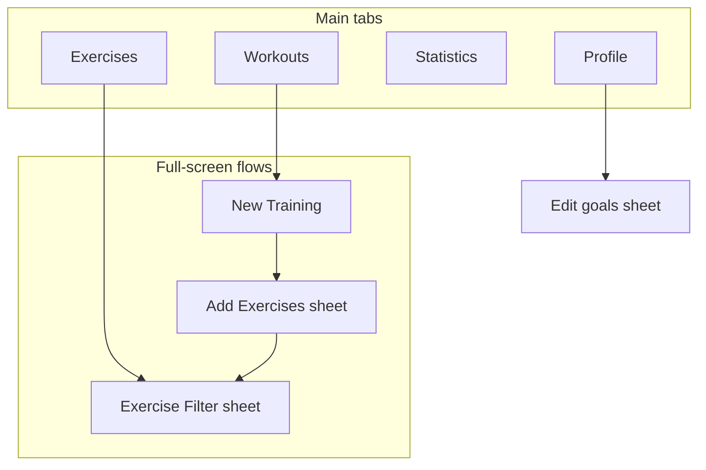

# Pro Fit — Visual Mockups

Dark-mode mobile UI mockups for the full Pro Fit fitness app. These are **design references only** — not wired into the Angular codebase.

## Design tokens

### App default (code)

| Token | Dark value | Usage |
|-------|------------|-------|
| `--pf-bg` | `#0e1116` | Page background |
| `--pf-surface` | `#161a21` | Cards, sheets, inputs |
| `--pf-text` | `#e8eaef` | Headings, body |
| `--pf-text-muted` | `#9aa3b2` | Subtitles, labels |
| `--pf-accent` | `#5a8dfe` | CTAs, links, selected tab |
| `--pf-border` | `#222833` | Card/sheet edges |
| `--pf-radius` | `14px` | Cards, buttons, chips |

Source: [`src/styles/_tokens.scss`](../src/styles/_tokens.scss)

### Workouts tab (mockup palette — mint minimal)

| Token | Value | Usage |
|-------|-------|-------|
| Background | `#0c1210` | Forest black page bg |
| Surface | `#1a2420` | Cards, grouped rows |
| Accent | `#34d399` | CTA, active tab, highlights |
| Text | `#f0fdf4` | Headings |
| Text muted | `#86efac` @ 50% / gray-green | Subtitles |
| Tab bar | Frosted glass blur | iOS vibrancy (coral-reference style) |

## Screen map

## Mockup index

| # | File | Screen | Code reference |
|---|------|--------|----------------|
| 01 | [`mockups/01-workouts-empty.png`](mockups/01-workouts-empty.png) | Workouts — empty state (**375×667**, flat UI, no device chrome) | `src/features/workout/` |
| 02 | [`mockups/02-workouts-list.png`](mockups/02-workouts-list.png) | Workouts — list | `src/features/workout/` |
| 03 | [`mockups/03-exercises-browse.png`](mockups/03-exercises-browse.png) | Exercises — browse (A–Z) | `src/features/exercise/` |
| 04 | [`mockups/04-exercises-search.png`](mockups/04-exercises-search.png) | Exercises — search active | `src/features/exercise/` |
| 05 | [`mockups/05-exercises-filter.png`](mockups/05-exercises-filter.png) | Exercises — filter sheet | `src/features/exercise/filter/` |
| 06 | [`mockups/06-new-training-empty.png`](mockups/06-new-training-empty.png) | New Training — empty | `src/features/workout/new/` |
| 07 | [`mockups/07-new-training-builder.png`](mockups/07-new-training-builder.png) | New Training — builder | `src/features/workout/new/` |
| 08 | [`mockups/08-add-exercises-sheet.png`](mockups/08-add-exercises-sheet.png) | Add Exercises sheet | `src/features/workout/new/add-exercises-sheet/workout-new-add-exercises-sheet.component` |
| 09 | [`mockups/09-statistics-overview.png`](mockups/09-statistics-overview.png) | Statistics — overview | `src/features/statistic/` (envisioned) |
| 10 | [`mockups/10-statistics-history.png`](mockups/10-statistics-history.png) | Statistics — history | `src/features/statistic/` (envisioned) |
| 11 | [`mockups/11-profile-main.png`](mockups/11-profile-main.png) | Profile — main | `src/features/profile/` (envisioned) |
| 12 | [`mockups/12-profile-goals-sheet.png`](mockups/12-profile-goals-sheet.png) | Profile — edit goals sheet | `src/features/profile/` (envisioned) |
| 16 | [`mockups/16-statistics-overview-themed.png`](mockups/16-statistics-overview-themed.png) | Statistics — overview (**themed**, `--pf-*` dark + pill tab bar) | `src/features/statistic/` (target) |
| 17 | [`mockups/17-statistics-history-themed.png`](mockups/17-statistics-history-themed.png) | Statistics — history (**themed**, `--pf-*` dark + pill tab bar) | `src/features/statistic/` (target) |

## Groups

### Workouts tab (01–02) — canonical design

Minimal mint theme with frosted-glass tab bar (icon style from coral reference, accent color mint):

- **Empty:** “Start strong” hero, line-art dumbbell glow, single **Create Workout** CTA
- **List:** Continue banner, MY ROUTINES grouped rows, duration/last session/exercise previews
- **Tab bar:** 4 tabs — Workouts (barbell, mint active), Exercises (figure icon), Statistics (chart), Profile (person); blurred dark vibrancy background

### Exercises tab (03–05)
- A–Z virtual list with thumbnails and muscle focus
- Inline search with highlighted matches
- Bottom sheet filter for focus area and equipment

### New Training flow (06–08)
- Full-screen builder (no tab bar)
- Expandable exercise cards with set logging (kg/reps)
- Add-exercises bottom sheet with recents and multi-select

### Statistics tab (09–10) — envisioned
- Summary cards, volume line chart, muscle-group bar chart
- Session history log with segmented Overview / History

### Profile tab (11–12) — envisioned
- Avatar, weekly goal progress ring, settings rows
- Edit goals bottom sheet with target stepper and split chips

## Notes

- Mockups 09–12 show **target UX** for tabs that are still placeholders in code.
- **Workouts mockups (01–02)** are the preferred reference for Workouts tab implementation.
- **`01-workouts-empty.png`** is a flat screen design at **375×667 px** (iPhone SE logical size) — no status bar, notch, Dynamic Island, or device frame.
- Form factor: iPhone portrait; other mockups may use ~390×844 until updated.
